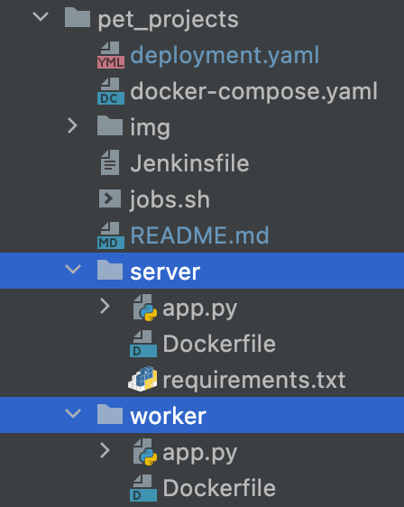

# RabbitMQ with Python (Flask)

## Introduction:
Background processing is a standard way of improving the performance and response times of your web applications.

In past years, I have used multi-threading and cron jobs to run background tasks, but my favorite mechanism is to use async message queues.

## Prerequisite:
We will use following technology stack for this project
* Docker
* RabbitMQ
* Ubuntu
* Flask

**Please ensure installation before using those software.**
## Project Layout

Create project directory as shown



Use following commands
```bash
$ mkdir server worker
$ touch server/apps.py server/Dockerfile server/requirements.txt
$ touch worker/apps.py worker/Dockerfile
```
The project directory will contain:
* **/server**, a python producer which will generate data for RabbitMQ 
* **/worker**, a python consumer which will receive data from RabbitMQ
* **docker-composer.yaml**, it will automate whole application.

### What Is Docker?

Docker helps developers build lightweight and portable software containers that simplify application development, testing, and deployment. The Docker goal is to ease the creation, deployment and the delivery of an application using the so called Containers. The Docker Containers allow the developer/sysadmin to bundle an application with all needed components (libraries and other resources) and to deliver it as an independent and single package.

Install Docker using official documentation https://docs.docker.com/engine/install/
 
### What Is RabbitMQ?
RabbitMQ is a fairly popular asynchronous message broker that can handle millions of messages.It originally implemented the Advanced Message Queuing Protocol (AMQP) but has been extended to support Streaming Text Oriented Messaging Protocol (STOMP), Message Queuing Telemetry Transport (MQTT), and other protocols. It is written in Erlang. But here we set up using Docker.

You can use many other services for background processes like Amazon SQS, Google Cloud Tasks etc. Other Redis based solutions are also available like Python-RQ. Redis is an open-source in-memory data source which can function as a message-broker, database, and a cache.

Now let’s install RabbitMQ using Docker’s official management image.

```bash
$ docker run -d -p 5672:5672 -p 15672:15672 rabbitmq:3-management
```
After this, you should be able to connect to http://locahost:15672 and see the RabbitMQ management console. Use the username and password guest to login.


## Flask Server
Create a directory `server` for server application source. Application source will developer in this location.

### Producer
Create a python file `app.py` for producer which will send data to rabbitmq for processing information.
> See details of Producer code [Producer `app.py`](server/app.py)  
> Details about Producer Docker file [Dockerfile](server/Dockerfile)

### Worker

The worker process is the main background process. It receives messages on the queue and executes some code based on the message. Most of the interesting stuff happens in the callback() function that gets invoked when a new message arrives.

For worker create worker folder and add `app.py` to receive messages and Dockerfile

> See details of Consumer code [Producer `app.py`](worker/app.py)  
> Details about Consumer Docker file [Dockerfile](worker/Dockerfile)

## Combine Everything with Docker Composer

For our system to work, we need all three processes — namely the RabbitMQ Server, Flask Server, and Worker Process — to run together. For a local development environment, it’s very convenient to use docker-compose to orchestrate this, as shown here.

Now create docker-compose.yml in root folder.

> See details with docker composer [Docker Composer](docker-compose.yaml)


### Run Application

Use the following command to run the docker and start all the processes:

```bash
$ docker-compose up -d
```

## References:
* https://dhruvadave5297.medium.com/demo-application-for-background-processing-with-rabbitmq-python-flask-c3402bdcf7f0


