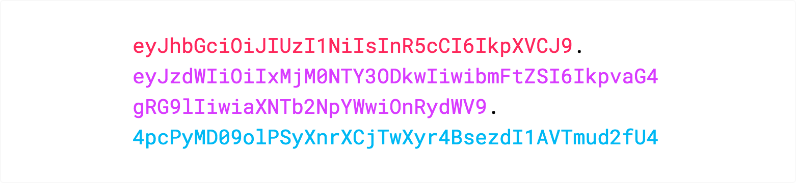
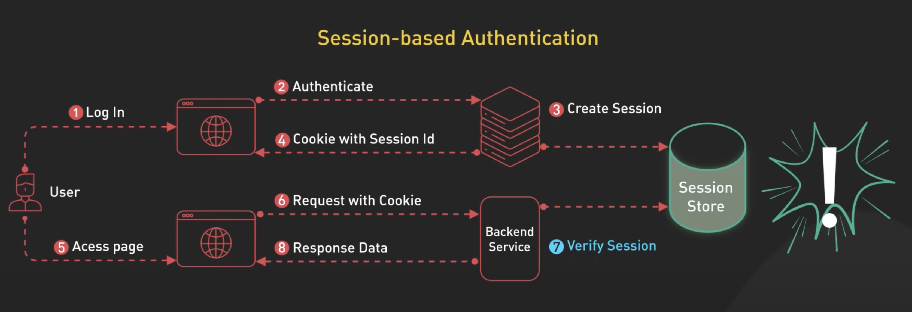
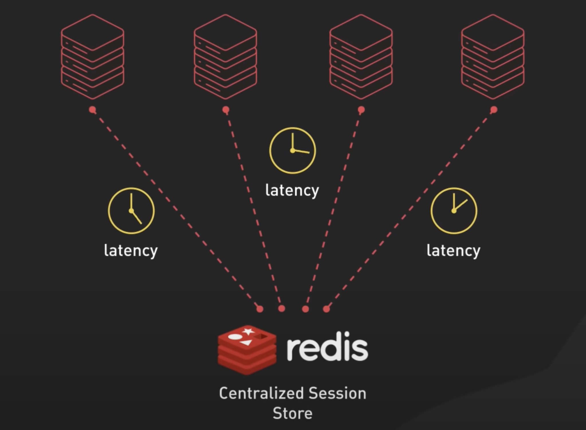
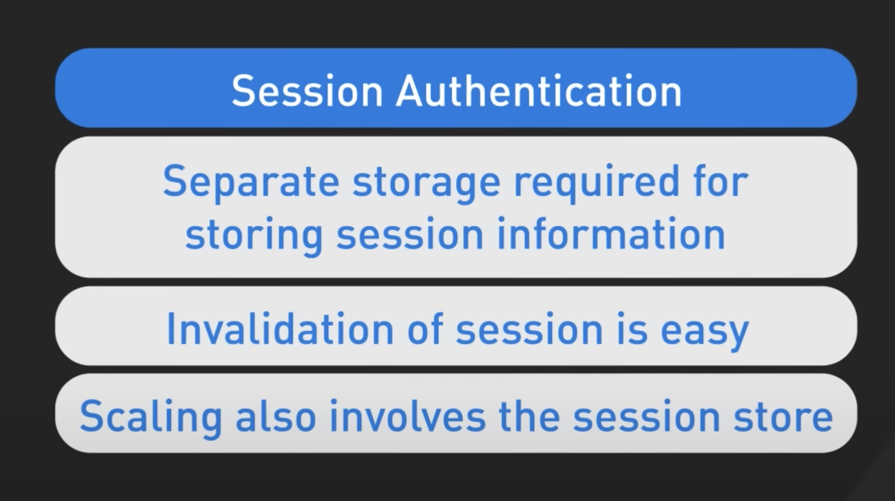

<div align="center">
    
    <h1>JWT (JSON Web Token)</h1>
    <strong>An open standard that allows two parties to securely share information in a JSON format.</strong>
</div>

# Introduction

JSON Web Token (JWT) is an open standard (RFC 7519) that defines a compact and self-contained way for securely
transmitting information between parties as a JSON object. This information can be verified and trusted because it is
digitally signed. JWTs can be signed using a secret (with the HMAC algorithm) or a public/private key pair using RSA or
ECDSA.

## When should you use JSON Web Tokens?

Here are some scenarios where JSON Web Tokens are useful:

- **Authorization**: Once the user logged in, it generates and return a JWT token, and each subsequent request will
  include
  the JWT token in every request to allowing user to access routes, services, and resources that are permitted with that
  token. **_Single Sign On_** is a feature that widely uses JWT.
- **Information Exchange**: JSON Web Tokens are a good way of securely transmitting information between parties. Because
  JWTs can be signed—for example, using public/private key pairs—you can be sure the senders are who they say they are.
  Additionally, as the signature is calculated using the header and the payload, you can also verify that the content
  hasn't been tampered with.

# What is the JSON Web Token structure?

In its compact form, JSON Web Tokens consist of three parts separated by dots (.),

- Header
- Payload
- Signature

JWT typically looks like the following.

```
Header.Payload.Signature

# Example
xxxxxx.yyyyyyy.zzzzzzzzz
```

Let's break down the different parts.

## Header

The header typically consists of two parts:

- The type of the token, which is JWT,
- The signing algorithm being used, such as HMAC SHA256 or RSA.

```shell
{
  "alg": "HS256",
  "typ": "JWT"
}
```

Then, this **JSON** is **Base64Url** encoded to form the first part of the **_JWT_**.

## Payload

The second part of the token is the payload, which contains the claims. Claims are statements about an entity (
typically, the user) and additional data.
There are three types of claims

- Registered Claims
- Public Claims
- Private Claims

Details of Claims

### Registered Claims

These are a set of predefined claims which are not mandatory but recommended, to provide a set of useful, interoperable
claims. Some of them are: iss (issuer), exp (expiration time), sub (subject), aud (audience), and others.

> Notice that the claim names are only three characters long as JWT is meant to be compact.

### Public Claims

These can be defined at will by those using JWTs. But to avoid collisions they should be defined in the IANA JSON Web
Token Registry or be defined as a URI that contains a collision resistant namespace.

### Private Claims

These are the custom claims created to share information between parties that agree on using them and are neither
registered or public claims.

```shell
{
  "sub": "1234567890",
  "name": "John Doe",
  "admin": true
}
```

The payload is then Base64Url encoded to form the second part of the JSON Web Token.


> Do note that for signed tokens this information, though protected against tampering, is readable by anyone. Do not put
> secret information in the payload or header elements of a JWT unless it is encrypted.

## Signature

To create the signature part you have to take the encoded header, the encoded payload, a secret, the algorithm specified
in the header, and sign that.

For example if you want to use the HMAC SHA256 algorithm, the signature will be created in the following way:

```shell
HMACSHA256(
  base64UrlEncode(header) + "." +
  base64UrlEncode(payload),
  secret)
```

**Putting all together**  
The signature is used to verify the message wasn't changed along the way, and, in the case of tokens signed with a
private key, it can also verify that the sender of the JWT is who it says it is.

The output is three Base64-URL strings separated by dots that can be easily passed in HTML and HTTP environments, while
being more compact when compared to XML-based standards such as SAML.

The following shows a JWT that has the previous header and payload encoded, and it is signed with a secret.



# How do JSON Web Tokens work?

In **authentication**, when the user successfully logs in using their credentials, a JSON Web Token will be returned.
Since
tokens are credentials, great care must be taken to prevent security issues. In general, you should not keep tokens
longer than required.

Whenever the user wants to access a protected route or resource, the user agent should send the JWT, typically in the
Authorization header using the Bearer schema. The content of the header should look like the following:

```
Authorization: Bearer <token>
```

This can be, in certain cases, a stateless authorization mechanism. The server's protected routes will check for a valid
JWT in the Authorization header, and if it's present, the user will be allowed to access protected resources. If the JWT
contains the necessary data, the need to query the database for certain operations may be reduced, though this may not
always be the case.

Note that if you send JWT tokens through HTTP headers, you should try to prevent them from getting too big. Some servers
don't accept more than 8 KB in headers. If you are trying to embed too much information in a JWT token, like by
including all the user's permissions, you may need an alternative solution, like Auth0 Fine-Grained Authorization.

If the token is sent in the Authorization header, Cross-Origin Resource Sharing (CORS) won't be an issue as it doesn't
use cookies.

> Do note that with signed tokens, all the information contained within the token is exposed to users or other parties,
> even though they are unable to change it. This means you should not put secret information within the token.

# Why should we use JSON Web Tokens?

Let's talk about the benefits of **JSON Web Tokens (JWT)** when compared to **Simple Web Tokens (SWT)** and **Security
Assertion
Markup Language Tokens (SAML)**.

As JSON is less verbose than XML, when it is encoded its size is also smaller, making JWT more compact than SAML. This
makes JWT a good choice to be passed in HTML and HTTP environments.

Security-wise, SWT can only be symmetrically signed by a shared secret using the HMAC algorithm. However, JWT and SAML
tokens can use a public/private key pair in the form of a X.509 certificate for signing. Signing XML with XML Digital
Signature without introducing obscure security holes is very difficult when compared to the simplicity of signing JSON.

JSON parsers are common in most programming languages because they map directly to objects. Conversely, XML doesn't have
a natural document-to-object mapping. This makes it easier to work with JWT than SAML assertions.

Regarding usage, JWT is used at Internet scale. This highlights the ease of client-side processing of the JSON Web token
on multiple platforms, especially mobile.

# Authentication

Authentication is a process that verifies the identity of a user or system before granting access to resources

## Session Based Authentication

Session-based authentication is a method where a server creates and manages a unique "session" for each user who logs
in, storing their identity information on the server and sending a session ID (often via a cookie) to the user's device,
allowing the server to recognize them across subsequent requests without requiring repeated logins; essentially, the
server keeps track of a user's login status within a specific session timeframe.


### Session-based Authentication Key Points

**Server-side storage:**  
The session data, including the user ID and other relevant information, is stored on the server.

**Session ID:**  
When a user logs in, the server generates a unique session ID and sends it to the user's device, usually through a
cookie.

**Cookie-based verification:**  
When the user makes a request, the browser automatically includes the session ID cookie, which the server then verifies
against its stored sessions to identify the user.

**Stateful authentication:**  
Unlike token-based authentication, session-based authentication is considered "stateful" because the server needs to
maintain information about the active sessions.

### How it works:

- **Login**: User submits their credentials (username and password) to the server.
- **Validation**: The server verifies the credentials against its database.
- **Session Creation**: If credentials are valid, the server creates a new session, stores user information, and generates a
unique session ID.
- **Session ID Sent to Client**: The session ID is sent back to the user's device usually as a cookie.
- **Subsequent Requests**: When the user makes further requests, the browser automatically sends the session ID cookie,
allowing the server to identify the user and grant access.



### Drawbacks of session-based authentication
**Scalability concerns:**  
Managing large numbers of sessions on a server can be challenging, especially with high traffic.

**Security risks:**  
If a session cookie is compromised, an attacker could potentially impersonate the user.



## JWT Based Authentication


# References

- https://jwt.io/introduction
- https://www.youtube.com/watch?v=fyTxwIa-1U0
