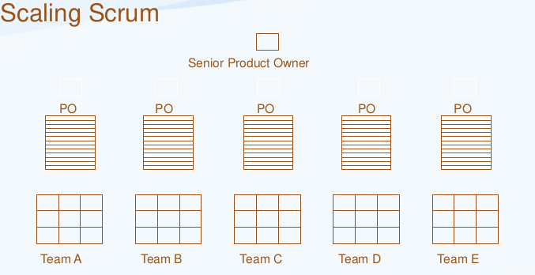

    
    <h1>Agile</h1>
    <strong></strong>

<!-- TOC -->

- [Agile](#agile)
    - [Introduction](#introduction)
        - [What is Agile?](#what-is-agile)
    - [Agile Manifesto](#agile-manifesto)
    - [Agile Principles](#agile-principles)
    - [Agile Frameworks](#agile-frameworks)
        - [Scrum](#scrum)
        - [Kanban](#kanban)
        - [Extreme Programming XP](#extreme-programming-xp)
        - [Crystal](#crystal)
        - [FDD](#fdd)
    - [Empiricism](#empiricism)
        - [Empirical Process](#empirical-process)
        - [Defined Process](#defined-process)
            - [Transparency](#transparency)
            - [Inspection](#inspection)
            - [Adaptation](#adaptation)
                - [Evolutionary Product Planning](#evolutionary-product-planning)
- [Scrum](#scrum)
    - [Scrum Values](#scrum-values)
    - [Scrum Framework](#scrum-framework)
        - [Scrum Accountabilities](#scrum-accountabilities)
            - [Scrum Team Member](#scrum-team-member)
            - [Characteristics of Scrum Team](#characteristics-of-scrum-team)
            - [Developers](#developers)
            - [The Product Owner](#the-product-owner)
            - [The Scrum Master](#the-scrum-master)
                - [Servant Leadership](#servant-leadership)
            - [Scrum Disadvantages](#scrum-disadvantages)
        - [Scrum Events](#scrum-events)
            - [Sprint](#sprint)
            - [Sprint Planning](#sprint-planning)
            - [Daily Scrum](#daily-scrum)
            - [Sprint Review](#sprint-review)
            - [Sprint Retrospective](#sprint-retrospective)
- [References](#references)

<!-- /TOC -->

# Agile

## Introduction

Scrum Alliance is the oldest non-profit membership organization for Scrum,
and that supports the adoption and effective use of Scrum. The three most
prominent offerings of the Scrum Alliance are

### What is Agile?

Agile is a mindset

- A mindset is a set of assumptions, methods, or notions held by one or more people or group of people.
- A mental inclination or disposition

**__Being Agile Over Doing Agile__**

* Agile is NOT a process
* Agile is NOT a framework
* Agile is NOT a methodology

To understand above state you need to understand following terms

<table>
  <thead>
  <tr>
    <td>Term</td>
    <td>Definition</td>
  </tr>  
  </thead>
 <tbody>
  <tr>
    <td>
      Process
    </td>
    <td>
      - A series of actions or steps taken in order to achieve a particular end.
    </td>
  </tr> 
   <tr>
    <td>
      Framework
    </td>
    <td>
      - A basic structure underlying a system, concept, or text.   
      - An essential supporting structure of a building, vehicle, or object.  
      - A set of practices aligning with a thought process.
    </td>
  </tr>
<tr>
    <td>
      Methodology
    </td>
    <td>
      - A system of methods used in a particular area of study or activity.   
      - Is the systematic, theoretical analysis of the methods applied to a field of study.  
    </td>
  </tr>
 </tbody>

</table>

**History**

## Agile Manifesto

We are uncovering better ways of developing software by doing it and helping others do it.

Through this work we have come to value:

| First Value                  | over | Second Value                |   
|------------------------------|------|-----------------------------|
| Individuals and interactions | OVER | processes and tools         |
| Working software             | OVER | comprehensive documentation |
| Customer collaboration       | OVER | contract negotiation        |
| Responding to change         | OVER | following a plan            |

That is, while there is value in the items on the right, we value the items on the left more.

## Agile Principles

| # | Principal                                                                                                                                     |
|---|-----------------------------------------------------------------------------------------------------------------------------------------------|
| 1 | Our highest priority is to satisfy the customer through early and continuous delivery of valuable software.                                   |
| 2 | Welcome changing requirements, even late in development. Agile processes harness change for the customer's competitive advantage.             |
| 3 | Deliver working software frequently, from a couple of weeks to a couple of months, with a preference to the shorter timescale.                |
| 4 | Business people and developers must work together daily throughout the project.                                                               |
| 5 | Build projects around motivated individuals. Give them the environment andsupport they need, and trust them to get the job done.              |
| 6 | The most efficient and effective method of conveying information to and within a development team is face-to-faceconversation.                |
| 7 | Working software is the primary measure of progress.                                                                                          |
| 8 | Agile processes promote sustainable development. The sponsors, developers, and users should be able to maintain a constant pace indefinitely. |
| 9 | Continuous attention to technical excellence and good design enhances agility.                                                                |
| 10 | Simplicity--the art of maximizing the amount of work not done--is essential.                                                                  |
| 11 | The best architectures, requirements, and designs emerge from self-organizing teams.                                                          |
| 12 | At regular intervals, the team reflects on how to become more effective, then tunes and adjusts its behavior accordingly.                     |

## Agile Frameworks

**Agile frameworks use Incremental & Iterative approaches together.**  
The idea is to develop a system through repeated cycles (iterative) and in smaller
portions at a time (incremental), allowing developers to take advantage of what
was learnt during development of earlier parts or versions of the system.

Incremental and Iterative approach describe as

|Method|Description|
|-----|--------|
| Incremental | This is a development approach that slices the system functionality into increments (portions). |
| Iterative | This is a development approach that breaks the process of developing a large product into smaller parts. Each part, called “iteration”, represents the whole development process and contains planning, design, development, and testing steps.|

Main characteristics of Agile Framework

* Collaboration
* Communication
* Focus on Quality
* Discipline
* Eliminate State
* Team Work - no hero
* Short Feedback Loops
* Lots of Planning

Popular agile framework used for which used for various domain and complexity

### Scrum

Scrum is a framework within which people can address
complex adaptive problems, while productively and
creatively delivering products of the highest possible
value.
A simple framework for effective team collaboration on
complex products.

### Kanban

Kanban is a lean method to manage and improve work across human systems. This approach aims to manage
work by balancing demands with available capacity, and by improving the handling of system-level bottlenecks.

### Extreme Programming (XP)

XP is a software development methodology which is intended to improve software quality and
responsiveness to changing customer requirements.

### Crystal

Crystal allows teams to work the way they deem most effective.

Based on:

- Human-powered
- Adaptive
- Ultra-light

### FDD

Feature Drive Development (FDD) is customer-centric, iterative, and incremental, with the goal of
delivering tangible software results often and efficiently

There are lots of framework available depending on agile mindset.

## Empiricism

There are two main process available

### Empirical Process

An empirical process is implemented where progress is based on observation and experimentation instead of
detailed, upfront planning and defined processes. Using empirical process control is working in a fact-based,
experience-based, and evidence-based manner,
not fictitious plans.

### Defined Process

A defined process is one with a set of steps that should
produce the same output every time within a defined
variance range, given the same inputs.

Scrum is based on Empirical Process Control

**Three Pillars of Empirical Process Control**

#### Transparency

The emergent process and work must be visible to those performing the
work as well as those receiving the work.

Transparency enables Inspection. Inspection without transparency is misleading and wasteful.

#### Inspection

Progress toward agreed goals must be inspected frequently and diligently to detect potentially undesirable variances or
problems.

Inspection enables Adaptation. Inspection without adaptation is considered pointless.

#### Adaptation

If any aspects of a process deviate outside acceptable limits or if the resulting product is
unacceptable, the process being applied or the materials being produced must be adjusted.

Adjustment must be made as soon as possible to minimize further deviation.

##### Evolutionary Product Planning

**Traditional Fixed Planning Versus Evolutionary Product Planning**  
Evolutionary product planning in an empirical environment differs from traditional fixed planning in the following ways:

- Processes are not repeatable, are visible, and promote inspection and adaptation.
- Work/process steps may not be understood.
- Impacted by factors such as past performance and capacity differences.
- Improvement and direction guided by experiments and experience.

# Scrum

Scrum is a lightweight framework that helps people, teams and organizations
generate value through adaptive solutions for complex problems. The Scrum framework is immutable.
While implementing only parts of Scrum is possible, the result is not Scrum.
Scrum exists only in its entirety and functions well as a container for other techniques, methodologies, and
practices.

- Scrum is an Agile framework for completing complex projects.
- Scrum originally was formalized for software development projects, but it works well for any complex, innovative scope
  of work. The
  possibilities are endless. The Scrum framework is deceptively simple.
- An Iterative and Incremental method from Agile Family

Main scrum characteristics

- Simple.
- Purposefully incomplete, only defining the parts required to implement Empiricism and Lean thinking.
- Built upon by the collective intelligence of the people using it.
- Wraps around existing practices or renders them unnecessary.

History

- Since early 1990s.
- First time presented in 1995.
- Latest update in Nov 2020.

## Scrum Values

As stated in Merriam-Webster dictionary

| Values     | Descriptions                                                                                                         |
|------------|----------------------------------------------------------------------------------------------------------------------|
| **Focus**  | Focus means a center of activity, attraction, or attention, a point of concentration.                                |
| **Openness**   | Openness means having no enclosing or confining barrier: accessible on all or nearly all sides.                      |
| **Respect**    | Respect means the act of giving particular attention or high or special regard.                                      |
| **Courage**    | Courage means the mental or moral strength to venture, persevere, and withstand danger, fear, or difficulty.         |
| **Commitment** | Commitment means an agreement or pledge to do something in the future, or an act of committing to a charge or trust. |

## Scrum Framework

<h3 style="color:red;">Scrum Framework is recommended as 3-5-3</h3>

<table>
  <tr>
    <th>Accountabilities (3)</th>
    <th>Events (5)</th>
    <th>Artifacts (3)</th>
  </tr>
  <tr>
    <td>
        <ol>
          <li>Product Owner</li> 
          <li>Scrum Master</li>
          <li>Developers</li>
        </ol>    
    </td>
    <td>
      <ol>
        <li>Sprint Planning</li>
        <li>Daily Scrum</li>
        <li>Sprint Review</li>
        <li>Sprint Retrospective</li>
        <li>Sprint</li>
    </ol>
    </td>
    <td>
        <ol>
            <li>Product Backlog</li>
            <li>Sprint Backlog</li>
            <li>Increment</li>
        </ol>
    </td>
  </tr>
</table>

> Sprint is considered as a Container Event.  
> Product Backlog Refinement is a recommended activity.

### Scrum Accountabilities

The fundamental unit of Scrum is a small team of people called as Scrum Team.

#### Scrum Team Member
- [Developers (one or more)](#developers)
- [The Product Owner (1)](#the-scrum-master)
- [The Scrum Master (1)](#the-scrum-master)

#### Characteristics of Scrum Team
- No Sub Team
- A cohesive unit of professionals focused on one objective at a time.
- Cross-functional.
- Self-managed – decides who does what, when and how.
- 10 people or fewer, smaller teams communicate better and are more productive.
- If Scrum Teams become too large, they should consider reorganizing into multiple cohesive Scrum Teams, each focused on the same product (see Scaling Scrum image)
- They should share the same Product Goal, Product Backlog, and Product Owner.
- The Scrum Team is responsible for all product-related activities from stakeholder collaboration, verification, maintenance, operation, experimentation, research and development, and anything else that might be required.
- They are structured and empowered by the organization to manage their own work.
- Working in Sprints at a sustainable pace improves the Scrum Team’s focus and consistency.
- The entire Scrum Team is accountable for creating a valuable, useful Increment every Sprint.

#### Developers
Developers are the people in the Scrum Team that are committed to creating any aspect of a usable Increment each Sprint.

The specific skills needed by the Developers are often broad and will vary with the domain of work.
However, the Developers are always accountable for:

**Responsibilities**
- Creating a plan for the Sprint, the Sprint Backlog;
- Instilling quality by adhering to a Definition of Done;
- Adapting their plan each day toward the Sprint Goal; and,
- Holding each other accountable as professionals.

**Event Responsibility**
- Sprint Planning
- Daily Scrum
- Sprint Review
- Sprint Retrospective
- Sprint

**Artifact Responsibility**
- Sprint Backlog
- Increment

#### The Product Owner
The Product Owner is accountable for maximizing the value of the product resulting from the work of
the Scrum Team. How this is done may vary widely across organizations, Scrum Teams, and individuals.

c
- Developing and explicitly communicating the Product Goal;
- Creating and clearly communicating Product Backlog items;
- Ordering Product Backlog items; and,
- Ensuring that the Product Backlog is transparent, visible and understood.
- The Product Owner may do the above work or may delegate the responsibility to others. Regardless, the Product Owner remains accountable.
- For Product Owners to succeed, the entire organization must respect their decisions.
- These decisions are visible in the content and ordering of the Product Backlog, and through the inspectable Increment at
the Sprint Review.

The Product Owner is one person, not a committee. The Product Owner may represent the needs of
many stakeholders in the Product Backlog. Those wanting to change the Product Backlog can do so by
trying to convince the Product Owner.

**Event Responsibility**
- Sprint Planning
- Daily Scrum
- Sprint Review
- Sprint Retrospective
- Sprint

**Artifact Responsibility**
- Product Backlog
- Sprint Backlog
- Increment

#### The Scrum Master
The Scrum Master is accountable for establishing Scrum as defined in the Scrum Guide. They do this by
helping everyone understand Scrum theory and practice, both within the Scrum Team and the
organization.

The Scrum Master is accountable for the Scrum Team’s effectiveness. They do this by enabling the
Scrum Team to improve its practices, within the Scrum framework.
Scrum Masters are true leaders who serve the Scrum Team and the larger organization.

**General Responsibility**
- Coaching and Mentoring.
- Removing roadblocks.
- Addressing team dynamics.
- Teach Scrum.
- Accountable for the Scrum Team’s effectiveness. They do this by enabling the Scrum Team to improve its practices, within the Scrum framework.
- Facilitate and Timeboxing Scrum Events.
- Ensuring a fruitful relationship between the Product Owner, Developers, and others outside the team. Reducing conflicts, and promote continuous improvement.
- Establishing an environment where the Scrum Team can be productive and efficient.
- Protecting the Developers from outside distractions and interruptions.

Performing the above responsibilities, will probably make a good Scrum Master.
Going beyond the responsibilities is about becoming a great Scrum Master.

**Event Responsibility**
- Sprint Planning
- Daily Scrum
- Sprint Review
- Sprint Retrospective
- Sprint

**Artifact Responsibility**
- Product Backlog
- Sprint Backlog
- Increment

##### Servant Leadership
Servant leadership is a leadership philosophy in which the leader serves. Unlike
traditional leadership, where the primary goal of the leader is to focus only on
the success of the organization, a servant leader shares power, decision making,
the needs and requirements of the employees, and helps them perform as a
high-productive team.

Servant Leadership means leading the Scrum Team by serving them – removing
high-priority blockers.

Leadership is no longer a given authority but provided as a service. A Scrum
Master accountability is not performed as ‘command and control’ leadership
but by ‘empowering and enabling’ teams. Scrum Master role is to improve the
efficiency of Developers, Product Owner, other Scrum Teams and, in fact the
entire organization. The main focus of a Scrum Master is to enable an open
mindset among various roles, units and leaders.

**_The Scrum Master serves the Scrum Team in several ways, including:_**
- Coaching the team members in self-management and cross-functionality;
- Helping the Scrum Team focus on creating high-value Increments that meet the Definition of Done;
- Causing the removal of impediments to the Scrum Team’s progress; and,
- Ensuring that all Scrum events take place and are positive, productive, and kept within the timebox.

**_The Scrum Master serves the Product Owner in several ways, including:_**
- Helping find techniques for effective Product Goal definition and Product Backlog management;
- Helping the Scrum Team understand the need for clear and concise Product Backlog items;
- Helping establish empirical product planning for a complex environment; and,
- Facilitating stakeholder collaboration as requested or needed.

**_The Scrum Master serves the organization in several ways, including:_**
- Leading, training, and coaching the organization in its Scrum adoption;
- Planning and advising Scrum implementations within the organization;
- Helping employees and stakeholders understand and enact an empirical approach for complex work; and,
- Removing barriers between stakeholders and Scrum Teams.

**_What Does the ScrumMaster NOT Do?_**
- The ScrumMaster does not manage the team
- The ScrumMaster does not direct team-members
- The ScrumMaster does not assign tasks
- The ScrumMaster does not “drive the team” to hit its goals
- The ScrumMaster does not make decisions for the team
- The ScrumMaster does not overrule team-members
- The ScrumMaster does not direct product strategy, decide technical issues, etc.

**_Different Hats of a Scrum Master_**  
**_Facilitation:_**  
A Scrum Master helps Scrum Teams and leaders in decision making. Thus,
Facilitator is the hat a Scrum Master wears, almost every day.
Facilitation includes several responsibilities such as:
- Facilitating Scrum events.
- Facilitating decision making for Developers, Product Owner and stakeholders.
- Facilitating difficult conversations.

**_Teaching:_**  
A Scrum Master helps Scrum Teams and leaders in decision making. Thus,
The Scrum Master wears the hat of a teacher at times. You may have to teach
the Scrum Team, the organization, stakeholders about the following:
- Agile Manifesto – Values and Principles
- Scrum Framework
- Scrum Values
- How to do Scrum right?
- And many more...
The Scrum Master also helps the organization to plan and adopt Scrum in the
organization.

**_Mentoring:_**  
A Scrum Master acts as a mentor at times, based on the experience gathered
over the years. During a difficult situation, the Developers may look up to
Scrum Master as a mentor to resolve their impediments.

**_Coaching:_**
A Scrum Master acts as a coach at times. Rather than providing decisions to
the Scrum Team or the organization, the Scrum Master helps to decide what is
the best course of action to be taken in a given situation. The ultimate goal is
to help people and organizations grow and become better. A Scrum Master
needs to guide people without being bossy or authoritative, which is
considered as one of the most challenging facets of the job. To perform this
responsibility better, a Scrum Master should have good analytical skills, good
negotiation skills, good communication skills. But more importantly, the Scrum
Master should have great listening skills.

**_Facilitation techniques for a Scrum Master_**

#### Scrum Disadvantages
- It’s hard!
- Makes all dysfunction visible
- Scrum doesn’t fix anything: the team has to do it
- Feels like things are worse at the beginning
- Bad products will be delivered sooner, and doomed projects will fail faster
- Some teams and organizations are not right or ready for it
- Team willingness, capabilities
- Management buy-in
- Risk of turnover during adoption
- Some people will refuse to stay on a Scrum team
- Some people will refuse to stay if Scrum is abandoned
- Partial adoption may be worse than none at all
- If adoption fails, time will have been wasted, and some people may leave

### Scrum Events
The Sprint is a container for all other events. Each event in Scrum is a formal opportunity to inspect and
adapt Scrum artifacts. These events are specifically designed to enable the transparency required.
Failure to operate any events as prescribed results in lost opportunities to inspect and adapt. Events are
used in Scrum to create regularity and to minimize the need for meetings not defined in Scrum.
Optimally, all events are held at the same time and place to reduce complexity.

There are Five Sprint Events which are describe below

#### Sprint
Sprints are the heartbeat of Scrum, where ideas are turned into value.
They are fixed length events of one month or less to create consistency. A new Sprint starts immediately
after the conclusion of the previous Sprint.

All the work necessary to achieve the Product Goal, including Sprint Planning, Daily Scrums, Sprint
Review, and Sprint Retrospective, happen within Sprints.

During the Sprint:
- No changes are made that would endanger the Sprint Goal;
- Quality does not decrease;
- The Product Backlog is refined as needed; and,
- Scope may be clarified and renegotiated with the Product Owner as more is learned.

Sprints enable predictability by ensuring inspection and adaptation of progress toward a Product Goal at
least every calendar month. When a Sprint’s horizon is too long the Sprint Goal may become invalid,
complexity may rise, and risk may increase. Shorter Sprints can be employed to generate more learning
7cycles and limit risk of cost and effort to a smaller time frame. Each Sprint may be considered a short
project.

Various practices exist to forecast progress, like burn-downs, burn-ups, or cumulative flows. While
proven useful, these do not replace the importance of empiricism. In complex environments, what will
happen is unknown. Only what has already happened may be used for forward-looking decision making.
A Sprint could be cancelled if the Sprint Goal becomes obsolete. Only the Product Owner has the
authority to cancel the Sprint.

#### Sprint Planning
Sprint Planning initiates the Sprint by laying out the work to be performed for the Sprint. This resulting
plan is created by the collaborative work of the entire Scrum Team.

The Product Owner ensures that attendees are prepared to discuss the most important Product Backlog
items and how they map to the Product Goal. The Scrum Team may also invite other people to attend
Sprint Planning to provide advice.

**_Sprint Planning addresses the following topics:_**

**_Topic One: Why is this Sprint valuable?_**  

The Product Owner proposes how the product could increase its value and utility in the current Sprint.
The whole Scrum Team then collaborates to define a Sprint Goal that communicates why the Sprint is
valuable to stakeholders. The Sprint Goal must be finalized prior to the end of Sprint Planning.

**_Topic Two: What can be Done this Sprint?_**  
Through discussion with the Product Owner, the Developers select items from the Product Backlog to
include in the current Sprint. The Scrum Team may refine these items during this process, which
increases understanding and confidence.

Selecting how much can be completed within a Sprint may be challenging. However, the more the
Developers know about their past performance, their upcoming capacity, and their Definition of Done,
the more confident they will be in their Sprint forecasts.

**_Topic Three: How will the chosen work get done?_**
For each selected Product Backlog item, the Developers plan the work necessary to create an Increment
that meets the Definition of Done. This is often done by decomposing Product Backlog items into
smaller work items of one day or less. How this is done is at the sole discretion of the Developers. No
one else tells them how to turn Product Backlog items into Increments of value.

The Sprint Goal, the Product Backlog items selected for the Sprint, plus the plan for delivering them are
together referred to as the Sprint Backlog.

Sprint Planning is timeboxed to a maximum of eight hours for a one-month Sprint. For shorter Sprints,
the event is usually shorter.

**_Sprint Goal_**
The Sprint Goal is the objective for the Sprint. Creates coherence and focus.

#### Daily Scrum 

#### Sprint Review

#### Sprint Retrospective

# References

* https://agilemanifesto.org/
* https://agilemanifesto.org/principles.html

