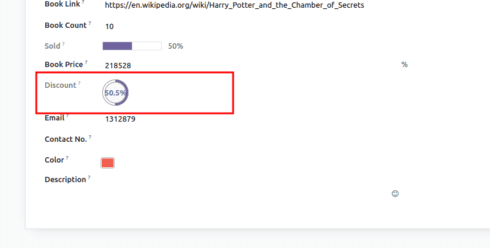
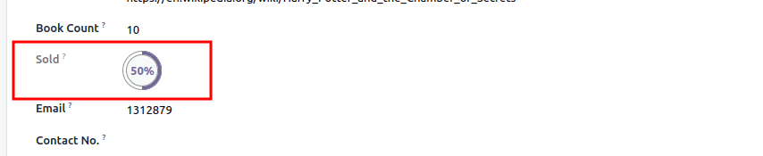

<div align="center">
    
    <h1>Tech Stacks</h1>
    <strong>A tech stack is the combination of technologies a company uses to build and run an application or project.</strong>
</div>


<!-- TOC -->

- [ODOO (On Demand Open Object)](#odoo-on-demand-open-object)
- [History](#history)
- [Odoo Features](#odoo-features)
  - [View Types](#view-types)
    - [1. Tree or List](#1-tree-or-list)
    - [2. Kanban](#2-kanban)
    - [3. Form](#3-form)
    - [4. Search](#4-search)
    - [5. Calendar](#5-calendar)
    - [6. Activity](#6-activity)
    - [7. Dashboard](#7-dashboard)
    - [8. Gantt](#8-gantt)
    - [9. Pivot](#9-pivot)
    - [10. Graph](#10-graph)
    - [11. Grid](#11-grid)
    - [12. Map](#12-map)
    - [13. Cohort](#13-cohort)
    - [14. Map](#14-map)
  - [Actions Types](#actions-types)
  - [Fields Types](#fields-types)
    - [1. Char (Text)](#1-char-text)
      - [1. Char Emoji (char\_emoji)](#1-char-emoji-char_emoji)
      - [2. URL](#2-url)
      - [3. text](#3-text)
      - [4. badge](#4-badge)
      - [5. email](#5-email)
      - [6. CopyClipboardChar](#6-copyclipboardchar)
      - [7. image](#7-image)
      - [7. phone](#7-phone)
      - [8. domain](#8-domain)
    - [2. Text (Multi-line)](#2-text-multi-line)
    - [3. Selection](#3-selection)
      - [1. badge](#1-badge)
      - [2. priority](#2-priority)
      - [3. radio](#3-radio)
    - [4. Numeric](#4-numeric)
      - [1. Float](#1-float)
        - [1. Monetary](#1-monetary)
        - [2. percentage](#2-percentage)
        - [3. percentpie](#3-percentpie)
        - [4. float\_time](#4-float_time)
      - [2. Interger](#2-interger)
        - [1. color\_picker](#1-color_picker)
        - [2. percentpie](#2-percentpie)
        - [3. progressbar](#3-progressbar)
        - [4. handle](#4-handle)
    - [5. Data / Time](#5-data--time)
      - [1. Date](#1-date)
      - [1. remaining\_days](#1-remaining_days)
      - [2. Datetime](#2-datetime)
      - [1. date](#1-date-1)
      - [2. remaining\_days](#2-remaining_days)
      - [2. daterange](#2-daterange)
    - [6. Boolean (Checkbox)](#6-boolean-checkbox)
      - [1. boolean\_toggle](#1-boolean_toggle)
      - [2. website\_publish\_button](#2-website_publish_button)
      - [3. boolean\_favorite](#3-boolean_favorite)
    - [7. Binary (Attachment)](#7-binary-attachment)
      - [1. image](#1-image)
      - [2. pdf\_viewer](#2-pdf_viewer)
    - [8. HTML](#8-html)
    - [9.  One2many](#9--one2many)
    - [10. Many2one](#10-many2one)
      - [1. badge](#1-badge-1)
      - [2. radio](#2-radio)
      - [3. many2one\_avatar\_employee](#3-many2one_avatar_employee)
      - [4. many2one\_avatar\_user](#4-many2one_avatar_user)
    - [11. Many2many](#11-many2many)
      - [1. many2many\_tags](#1-many2many_tags)
      - [2. many2many\_checkboxes](#2-many2many_checkboxes)
      - [3. many2many\_tags\_avatar](#3-many2many_tags_avatar)
    - [12. Related](#12-related)
- [Documentation](#documentation)
  - [Sources](#sources)
  - [References](#references)

<!-- /TOC -->


# ODOO (On Demand Open Object)
History. In 2005, Fabien Pinckaers, the founder and current CEO of Odoo, started to develop his first software product, TinyERP. Three years later, the name was changed to OpenERP.


# History

# Odoo Features
## View Types
### 1. Tree or List

```xml

```


### 2. Kanban

```xml

```


### 3. Form

```xml

```


### 4. Search

```xml

```


### 5. Calendar

```xml

```


### 6. Activity

```xml

```


### 7. Dashboard

```xml

```


### 8. Gantt

```xml

```


### 9. Pivot

```xml

```


### 10. Graph

```xml

```


### 11. Grid

```xml

```


### 12. Map


```xml

```


### 13. Cohort

```xml

```


### 14. Map

```xml

```


## Actions Types

## Fields Types
There are 15 fields types of fields available in Odoo.
### 1. Char (Text)
   Char field is used for storing string values.
   ```python
   name = fields.Char('Title', required=True)
   ```
   **Widgets**

   #### 1. Char Emoji (char_emoji)
   ```python
   <field name="name" widget="char_emojis"/>
   ```
   

   #### 2. URL
   ```python
   <field name="book_url" widget="url"/>
   ```
   

   #### 3. text
   ```python
   <field name="name" widget="text"/>
   ```
   

   #### 4. badge
   ```python
   <field name="name" widget="badge"/>
   ```
   

   #### 5. email
   ```python
   <field name="name" widget="email"/>
   ```
   
   
   #### 6. CopyClipboardChar
   ```python
   <field name="name" widget="CopyClipboardChar"/>
   ```
   

   #### 7. image
   ```python
   <field name="name" widget="image"/>
   ```
   

   #### 7. phone
   ```python
   <field name="name" widget="image"/>
   ```

   #### 8. domain
   ```python
   <field name="name" widget="domain"/>
   ```
   


### 2. Text (Multi-line)
   In the Text field, the user can store multiline values containing any characters.	
   ```python
   description = fields.Text("Description")
   ```
   

### 3. Selection
Selection Field, users can select a value from a list of values, then the selected value will be stored in the database.
```python
STATES = [
            ('publish', 'Published'), 
            ('unpublish', 'Unpublished')
         ]
state = fields.Selection(STATES, string='Status')
```


**Widgets**  
#### 1. badge
Displays the selected values in a rounded shape. This widget will not allow editing the value but can give a default value.
```python
<field name="state" widget="badge"/>
```


#### 2. priority
displays star symbols instead of values. This widget is commonly used for displaying the priority of records.

```python
<field name="priority" widget="priority"/>
```


#### 3. radio
displays selection field values as radio buttons

```python
<field name="state" widget="radio"/>
```


### 4. Numeric
   #### 1. Float
   Float field stores decimal values.
   ```python
   price = fields. Float("Book Price")
   ```
   **Widgets**  
   ##### 1. Monetary
   Widget used to show float value as monetary similar to Monetary field type.
   ```python
   <field name="price" widget="monetary"/>
   ```
   

   ##### 2. percentage
   ```python
   <field name="price" widget="percentage"/>
   ```
   


   ##### 3. percentpie
   displays float value inside a percentage circle. It is usually used for computed float fields.

   ```python
   <field name="discount" widget="percentpie"/>
   ```
   

   ##### 4. float_time
   displays float value in hh:mm format.
   ```python
   <field name="time" widget="float_time"/>
   ```
   


   #### 2. Interger
   Integer field stores all integer values including positive, negative, or zero, without decimal values.
   ```python
   book_count = fields.Integer('Book Count')
   ```
   **Widgets**
   ##### 1. color_picker
   able to choose different colors for the records.
   ```python
   <field name="color" widget="color_picker"/>
   ```
   

   ##### 2. percentpie
   displays the integer value in percentage inside a circle. Since the integer fields with this widget are not editable, this is commonly used for computed fields.

   ```python
   <field name="sold_count" widget="percentpie"/>
   ```
   

   ##### 3. progressbar
   displays the integer value in percentage near

a percentage bar. This is also used for computed fields.

   ```python
   <field name="color" widget="progressbar"/>
   ```
   

   ##### 4. handle
   This widget displays a drag handle to order the records from the list view.

   ```python
   <field name="sequence" widget="handle"/>
   ```
   

### 5. Data / Time
   #### 1. Date
   The Date field type is used to select a date from the calendar.
   ```python
   published_date = fields.Date(string="Published Date")
   ```
   

   **Widgets**
   #### 1. remaining_days
   this widget calculates the remaining days based on the selected date.
   ```python
   <field name="published_date" widget="remaining_days"/>
   ```
   

   #### 2. Datetime
   This field type is used to select both date and time from the calendar.
   ```python
   date = fields.Datetime(string='Order Date')
   ```
   
   
   **Widgets**
   #### 1. date
   used to display date without time.

   ```python
   <field name="published_date" widget="remaining_days"/>
   ```
   

   #### 2. remaining_days
   Displays the remaining number of days before the selected date (e.g., In 5 days), based on the current date and time.

   #### 2. daterange
   using this widget, the user can choose a date time range like below
   ```python
   <field name="date_begin" widget="daterange" string="from" class="oe_inline" options="{'related_end_date': 'date_end'}"/>
   <field name="date_end" widget="daterange" string="To"  class="oe_inline" options="{'related_start_date': 'date_begin'}"/>
   ```
   

### 6. Boolean (Checkbox)
This field type is used when the field value will either true or false.	
```python
published = fields.Boolean('Published')
```


**Widgets**
#### 1. boolean_toggle
This widget displays the boolean field like a toggle button.
```python
<field name="published" widget="boolean_toggle"/>
```


#### 2. website_publish_button
This widget can be used to show if it is published on the website or not.
```python
<field name="published" widget="website_publish_button"/>
```


#### 3. boolean_favorite
 this widget will change the style of a boolean field to a star similar to "priority” widget
```python
<field name="is_favourite"  widget="boolean_favorite" nolabel="1"/>
```


### 7. Binary (Attachment)
Binary fields store binary files, such as images or documents.
```python
file = fields.Binary(string="File")
```


**Widgets**

#### 1. image
Using this widget, users can upload image files in the Binary field similar to the Image field type.
```python
<field name="file" widget="image"/>
```


#### 2. pdf_viewer
user can upload a pdf file, which can be viewed below.

```python
<field name="file" widget="pdf_viewer"/>
```


### 8. HTML

```python
description = fields.Html('Description')
```

```xml
<field name="description" widget="html"/>
```

### 9.  One2many
The One2many field displays the multiple records from another model with an existing relationship to the current model.

In the One2many field, the two related models should have a connection by using a Many2one field. Here, in the example below, ‘book_id’ is the many2one field in ‘book.category’ field that links this model with the current model.
```python
category_ids = fields.One2many('book.category', 'book_id')
```


### 10. Many2one
Many2one field type in Odoo lists the records from another model to the record being created.
```python
author_id = fields.Many2one('res.partner', string="Author")
```


**Widgets**
#### 1. badge
the many2one field value will display like a badge. The value cannot be then edited.
```python
<field name="author_id" widget="badge"/>
```


#### 2. radio
all the values that can be selected from the Many2one field will display like radio buttons
```python
<field name="author_id" widget="radio"/>
```


#### 3. many2one_avatar_employee
this widget can be used in the Many2one field which has relation to the model ‘hr.employee’. It displays the avatar of the employee selected in the field

```python
<field name="employee_id" widget="many2one_avatar_employee"/>
```


#### 4. many2one_avatar_user
this widget can be used in the Many2one field, which has relation to the model ‘res.users’. It displays the avatar of the user selected in the field.

```python
<field name="user_id" widget="many2one_avatar_user"/>
```


### 11. Many2many
Many2many field type in Odoo lists multiple records from another model to the record being created.
```python
tag_ids = fields.Many2many('book.category', string='Tags')
```
**Widgets**
#### 1. many2many_tags
Using this widget, the user can view the multiple records selected in the Many2many field, like tags.
```python
<field name="tag_ids" widget="many2many_tags"/>
```


#### 2. many2many_checkboxes
This widget will display the Many2many field in checkboxes.
```python
<field name="tag_ids" widget="many2many_checkboxes"/>
```


#### 3. many2many_tags_avatar
This widget can be used in the Many2many field, which has relation to ‘res.partner’ model, and it will display the avatar of the selected contact records.
```python
<field name="author_ids" widget="many2many_tags_avatar"/>
```


### 12. Related


# Documentation
## Sources
## References
- https://www.cybrosys.com/blog/field-types-and-widgets-in-odoo-16
