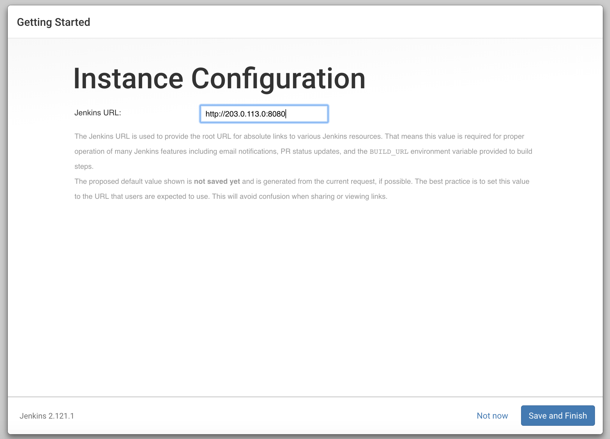

<div align="center" style="margin-bottom: 15px;">
    
    <h1>Jenkins</h1>
    <strong>Jenkins is an open-source CI/CD server that helps automate various stages in software development and DevOps processes.</strong>
</div>


<!-- TOC -->

- [Introduction](#introduction)
  - [Jenkin History](#jenkin-history)
- [Installation](#installation)
  - [Software Prerequisites](#software-prerequisites)
    - [Step 1: Configure the prerequisites environment](#step-1-configure-the-prerequisites-environment)
    - [Step 2: Jenkins regular management operations](#step-2-jenkins-regular-management-operations)
    - [Step 3: Configure operating system](#step-3-configure-operating-system)
    - [Step 4: Prepare Jenkins](#step-4-prepare-jenkins)
  - [Knowledge Prerequisites](#knowledge-prerequisites)
- [Features](#features)
- [Tutorials](#tutorials)
  - [Create New Projects in Jenkins](#create-new-projects-in-jenkins)
- [Interviews Questions](#interviews-questions)
- [References](#references)


<!-- /TOC -->

# Introduction
[Jenkins](https://www.jenkins.io/) is an open-source CI/CD server that helps automate various stages in software development and DevOps processes. Continuous Integration is a process of integrating code changes from multiple developers in a single project many times.

Jenkins is a server-based application and requires a web server like Apache Tomcat to run on various platforms like Windows, Linux, macOS, Unix, etc. To use Jenkins, you need to create pipelines which are a series of steps that a Jenkins server will take.

## Jenkin History
- Kohsuke Kawaguchi, a Java developer, working at SUN Microsystems, was tired of building the code and fixing errors repetitively. In 2004, created an automation server called Hudson that automates build and test task.
- In 2011, Oracle who owned Sun Microsystems had a dispute with Hudson open source community, so they forked Hudson and renamed it as Jenkins.
- Both Hudson and Jenkins continued to operate independently. But in short span of time, Jenkins acquired a lot of projects and contributors while Hudson remained with only 32 projects. With time, Jenkins became more popular, and Hudson is not maintained anymore.


# Installation

[Jenkins installation](https://www.jenkins.io/doc/book/installing/) mostly depends on operating system like linux, mac, windows, containers. They are listed like

1. Linux
2. Mac OS 
3. Windows
4. Docker
5. Kubernetes
6. Other Systems

> [Jenkins installation](https://www.jenkins.io/doc/book/installing/) you will get all the guidelines for installing.

## Software Prerequisites
There are several ways to install jenkins but in practice we will install here linux, and Jenkins installers are available for several Linux distributions.
- Debian/Ubuntu
- Fedora
- RedHat/Alma/Rocky

All installation instructions are for Ubuntu

On Debian and Debian-based distributions like Ubuntu you can install Jenkins through apt.

### Step 1: Configure the prerequisites environment

1. Installing Java
```bash
$ sudo apt update -y
$ sudo apt install fontconfig openjdk-17-jre
```

2. First, add the repository key to your system
```bash
$ wget -q -O - https://pkg.jenkins.io/debian-stable/jenkins.io.key |sudo gpg --dearmor -o /usr/share/keyrings/jenkins.gpg
```

3. After that add Debian packages repository address to the server `sources.list`.
```bash
$ sudo sh -c 'echo deb [signed-by=/usr/share/keyrings/jenkins.gpg] http://pkg.jenkins.io/debian-stable binary/ > /etc/apt/sources.list.d/jenkins.list'
```

4. Now jenkins is available in system
```bash
$ apt update -y 
$ apt install jenkins -y
```

### Step 2: Jenkins regular management operations

As jenkins is availabel in the system then you can manage it using `systemctl`.
```bash
# start jenkins service using
$ systemctl start jenkins

# status jenkins service
$ systemctl status jenkins
```

### Step 3: Configure operating system 
Jenkins uses os port `8080` to connect to the server so need to open this port in firewall for outer world
```bash
# allow port in firewall
$ sudo ufw allow 8080

# if firewall is not active then 
$ sudo ufw allow OpenSSH
$ sudo ufw enable

# firewall status
$ sudo ufw status
```


### Step 4: Prepare Jenkins
To complete Jenkins installation you need to browse following url `http://<JENKINS_OS_IP>:8080/`.   
> JENKINS_OS_IP: it is IP where you install your jenkins application.


Explore in jenkins configured os and copy password from there and past in input field.

```bash
sudo cat /var/lib/jenkins/secrets/initialAdminPassword
```

If you continue Jenkins installation you will see those ui one after another.

Plugins Installation
<hr/>


Getting Stated
<hr/>


Create Admin User
<hr/>


Instance Domain Configuration
<hr/>



Jenkins Homepage
<hr/>


## Knowledge Prerequisites
There are serveral knowledge requirements for Jenkins

# Features

# Tutorials
There are a number of tutorials available for jenkins

## Create New Projects in Jenkins


# Interviews Questions

# References
- https://www.jenkins.io/doc/
- https://www.guru99.com/jenkin-continuous-integration.html
- https://www.youtube.com/watch?v=saiCjlJpfdA&list=PLvBBnHmZuNQJeznYL2F-MpZYBUeLIXYEe

