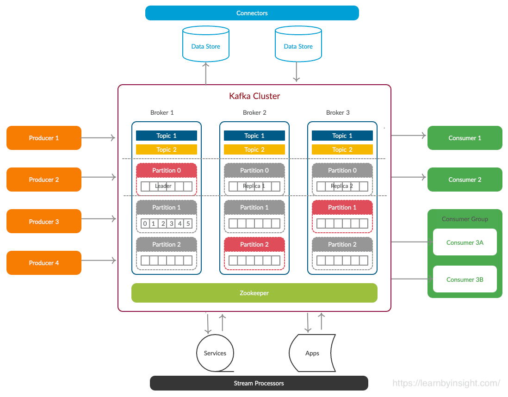

    <h1>Components of Kafka</h1>
    <strong>Components of Stream Processing System</strong>

 

<!-- TOC -->

- [Kafka Cluster](#kafka-cluster)
    - [Broker](#broker)
    - [Zookeeper](#zookeeper)
    - [Producers](#producers)
    - [Consumers](#consumers)
    - [Partitions](#partitions)
    - [Offsets](#offsets)
    - [Kafka Topics](#kafka-topics)
    - [Replication Factor](#replication-factor)
    - [Consumer Group](#consumer-group)
- [References:](#references)

<!-- /TOC -->

 

# Kafka Cluster
A Kafka cluster is a system that comprises of different brokers, topics, and their respective partitions. Data is written to the topic within the cluster and read by the cluster itself.

Kafka cluster components are describe and defined below

1. [Broker](#1-broker)
2. [Zookeeper](#2-zookeeper)
3. [Producers](#3-producers)
4. [Consumers](#4-consumers)
5. [Partitions](#5-partitions)
6. [Offsets](#6-offsets)

## 1. Broker
A Kafka server is known as a broker.Kafka cluster typically consists of multiple brokers to maintain load balance. A broker is a bridge between producers and consumers.Kafka brokers are stateless, so they use ZooKeeper for maintaining their cluster state. One Kafka broker instance can handle hundreds of thousands of reads and writes per second and each bro-ker can handle TB of messages without performance impact. Kafka broker leader election can be done by ZooKeeper.

- Kafka broker are stateless, zookeeper main the state
- Kafka broker leader election done by zookeeper
- Cluster consist of multiple broker
- Multiple brokers for load balancing

## 2. Zookeeper
A ZooKeeper is used to store information about the Kafka cluster and details of the consumer clients. It manages brokers by maintaining a list of them. Also, a ZooKeeper is responsible for choosing a leader for the partitions. If any changes like a broker die, new topics, etc., occurs, the ZooKeeper sends notifications to Apache Kafka. A ZooKeeper is designed to operate with an odd number of Kafka servers. Zookeeper has a leader server that handles all the writes, and rest of the servers are the followers who handle all the reads. However, a user does not directly interact with the Zookeeper, but via brokers. No Kafka server can run without a zookeeper server. It is mandatory to run the zookeeper server.
- ZooKeeper is responsible for choosing a leader for the partitions.
- ZooKeeper is designed to operate with an odd number of Kafka servers.
- ZooKeeper stores the details and information related to the Kafka Cluster of the Consumers
- Zookeeper has a leader server that handles all the writes, and rest of the servers are the followers who handle all the reads.
- ZooKeeper service is mainly used to notify producer and consumer about the presence of any new broker in the Kafka system or failure of the broker in the Kafka system.

## 3. Producers
Producers push data to brokers. When the new broker is started, all the producers search it and automatically sends a message to that new broker. Kafka producer doesn’t wait for acknowledgements from the broker and sends messages as fast as the broker can handle. When the producer adds the data to the Topic, it gets published to the Topic’s Leader. Then, these records are attached to the Leader’s Commit Log. Here, the record offset increases. Each of these data is collected on the cluster. However, these records are only released to the Consumer when it is committed.

Therefore, it becomes essential for producers to acquire metadata related to the cluster from the Broker before sharing the records.

key points -
- A producer is used for sending or publishing data or messages to the Topic.
- Different Kafka Producers submit data to Kafka Cluster to store innumerable data.
- You should be aware that the Producers is capable of delivering messages as instantly as the Broker can handle them.
- 

## 4. Consumers
Since Kafka brokers are stateless, which means that the consumer has to maintain how many messages have been consumed by using partition offset. If the consumer acknowledges a particular message offset, it implies that the consumer has consumed all prior messages. The consumer issues an asynchronous pull request to the broker to have a buffer of bytes ready to consume. The consumers can rewind or skip to any point in a partition simply by supplying an offset value. Consumer offset value is notified by ZooKeeper.

Next in the Kafka Architecture (Cluster, Topics, Producers, Partitions, Consumers, and Zookeeper) is a Kafka Consumer. It refers to the one who reads and consumes the Kafka Cluster messages. Consumers are provided with the option of reading messages starting at a specific point and ending at the point they desire. This allows customers to join the Kafka Clusters at any moment.

Kafka usually includes two types of customers, namely Low Level Consumers and High Level Consumers. The role of Low Level Consumers is to specify the Topics and Partitions and the offset that enables them to read. It can either be fixed or variable. High level Consumers, on the other hand, comprise one or more consumers.

## 5. Partitions
In a Kafka cluster, Topics are split into Partitions and also replicated across brokers.

- However, to which partition a published message will be written, there is no guarantee about that.
- Also, we can add a key to a message. Basically, we will get ensured that all these messages (with the same key) will end up in the same partition if a producer publishes a message with a key. Due to this feature, Kafka offers message sequencing guarantee. Though, unless a key is added to it, data is written to partitions randomly.
- Moreover, in one partition, messages are stored in the sequenced fashion.
- In a partition, each message is assigned an incremental id, also called offset.
- However, only within the partition, these offsets are meaningful. Moreover, in a topic, it does not have any value across partitions.
- There can be any number of Partitions, there is no limitation.

## 6. Offsets
Within the Kafka Cluster, topics are divided into partitions, which are replicated across brokers. Consumers can read from a topic parallelly from every partition. Moreover, by utilizing keys, users can guarantee the order of processing for messages in Kafka, sharing similar keys. It is highly reliable for applications that need complete control over the records. You can also create limitless partitions in Kafka architecture.
- Topics are divided into partitions
- Consumers can read from a topic parallelly from every partition

## 7. Kafka Topics
It is a common name or a heading given to represent a similar type of data. In Apache Kafka, there can be multiple topics in a cluster. Each topic specifies different types of messages. It arranges all the records of Kafka, which allows Consumer apps to read data. Topics are also separated into customizable sections called partitions. The topic is a logical channel to which producers publish message and from which the consumers receive messages.
- Group of message with a common name
- A topic defines the stream of a particular type/classification of data, in Kafka.
- Moreover, here messages are structured or organized. A particular type of messages is published on a particular topic.
- Basically, at first, a producer writes its messages to the topics. Then consumers read those messages from topics.
- In a Kafka cluster, a topic is identified by its name and must be unique.
- There can be any number of topics, there is no limitation.
- We can not change or update data, as soon as it gets published. 

## Replication Factor
While designing a Kafka system, it’s always a wise decision to factor in topic replication. As a result, its topics’ replicas from another broker can solve the crisis, if a broker goes down. For example, we have 3 brokers and 3 topics.

Broker1 has Topic 1 and Partition 0, its replica is in Broker2, so on and so forth. It has got a replication factor of 2; it means it will have one additional copy other than the primary one. Below is the image of Topic Replication Factor:

Some key points –
1. Replication takes place in the partition level only.
2. For a given partition, only one broker can be a leader, at a time. Meanwhile, other brokers will have in-sync replica; what we call ISR.
3. It is not possible to have the number of replication factor more than the number of available brokers.

## Consumer Group
- It can have multiple consumer process/instance running.
- Basically, one consumer group will have one unique group-id.
- Moreover, exactly one consumer instance reads the data from one partition in one consumer group, at the time of reading.
- Since, there is more than one consumer group, in that case, one instance from each of these groups can read from one single partition.
- However, there will be some inactive consumers, if the number of consumers exceeds the number of partitions. Let’s understand it with an example if there are 8 consumers and 6 partitions in a single consumer group, that means there will be 2 inactive consumers.

So, this was all about Apache Kafka Architecture. Hope you like our explanation.

# References:
* https://www.javatpoint.com/apache-kafka-architecture
* https://data-flair.training/blogs/kafka-architecture/
* https://cloudinfrastructureservices.co.uk/kafka-architecture-cluster-topics-producers-partitions-consumers-zookeeper/
* https://www.tutorialspoint.com/apache_kafka/apache_kafka_cluster_architecture.htm