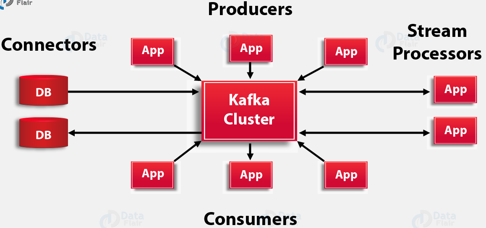

<div align="center">
    <h1>Kafka Architecture – Apache Kafka APIs</h1>
    <strong>Kafka Architecture – Apache Kafka APIs</strong>
</div>
<br/>

<!-- TOC -->

- [Kafka Architecture – Apache Kafka APIs](#kafka-architecture--apache-kafka-apis)
    - [Producer API](#producer-api)
    - [Consumer API](#consumer-api)
    - [Streams API](#streams-api)
    - [Connector API](#connector-api)
- [References](#references)

<!-- /TOC -->


<br/>

# Kafka Architecture – Apache Kafka APIs
Apache Kafka Architecture has four core APIs, 
* [Producer API](#1-producer-api)
* [Consumer API](#2-consumer-api)
* [Streams API](#3-streams-api)
* [Connector API](#4-connector-api)

**__Let’s discuss them one by one__**

## 1. Producer API
In order to publish a stream of records to one or more Kafka topics, the Producer API allows an application. 

```bash
# Manually assign a list of TopicPartitions to this consumer.
assign(partitions)


# Get the TopicPartitions currently assigned to this consumer.
assignment()

# Get the first offset for the given partitions.
beginning_offsets(partitions)

# Return True if the bootstrap is connected.
bootstrap_connected()

close(autocommit=True)
# Close the consumer, waiting indefinitely for any needed cleanup.

# Commit offsets to kafka, blocking until success or error.
commit(offsets=None)

# Commit offsets to kafka asynchronously, optionally firing callback.
commit_async(offsets=None, callback=None)


# Get the last committed offset for the given partition.
committed(partition, metadata=False)

# Get the last offset for the given partitions. The last offset of a partition is the offset of the upcoming message, i.e. the offset of the last available message + 1.
end_offsets(partitions)

# Last known highwater offset for a partition.
highwater(partition)

# Get metrics on consumer performance.
metrics(raw=False)

# Look up the offsets for the given partitions by timestamp. The returned offset for each partition is the earliest offset whose timestamp is greater than or equal to the given timestamp in the corresponding partition.
offsets_for_times(timestamps)

# This method first checks the local metadata cache for information about the topic. If the topic is not found (either because the topic does not exist, the user is not authorized to view the topic, or the metadata cache is not populated), then it will issue a metadata update call to the cluster.
partitions_for_topic(topic)

# Suspend fetching from the requested partitions.
pause(*partitions)

Future calls to poll() will not return any records from these partitions until they have been resumed using resume().

Note: This method does not affect partition subscription. In particular, it does not cause a group rebalance when automatic assignment is used.


# Get the partitions that were previously paused using pause().
paused()

# Fetch data from assigned topics / partitions.
poll(timeout_ms=0, max_records=None, update_offsets=True)

# Get the offset of the next record that will be fetched
position(partition)

# Resume fetching from the specified (paused) partitions.
resume(*partitions)

# Manually specify the fetch offset for a TopicPartition.
seek(partition, offset)

seek_to_beginning(*partitions)
# Seek to the oldest available offset for partitions.

# Seek to the most recent available offset for partitions.
seek_to_end(*partitions)

# Subscribe to a list of topics, or a topic regex pattern.
subscribe(topics=(), pattern=None, listener=None)

# Get the current topic subscription.
subscription()

```

Read details about [Producer API](https://kafka-python.readthedocs.io/en/master/apidoc/KafkaConsumer.html) for python.

## 2. Consumer API
This API permits an application to subscribe to one or more topics and also to process the stream of records produced to them.

## 3. Streams API
Moreover, to act as a stream processor, consuming an input stream from one or more topics and producing an output stream to one or more output topics, effectively transforming the input streams to output streams, the streams API permits an application.

## 4. Connector API
While it comes to building and running reusable producers or consumers that connect Kafka topics to existing applications or data systems, we use the Connector API. For example, a connector to a relational database might capture every change to a table.


# References
* https://data-flair.training/blogs/kafka-architecture/
* https://kafka-python.readthedocs.io/en/master/apidoc/modules.html

